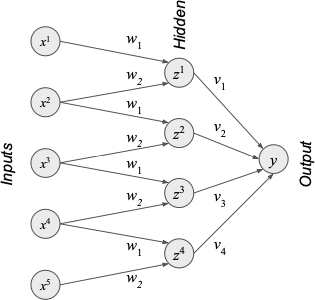

# Artificial Intelligence and Machine Learning Final Assignment

The goal of this assignment was to implement a simple two-layer Convolutional Neural Network (CNN). As depicted in the image, the CNN has five inputs, _x_1 to _x_5, four hidden nodes, _z_1 to _z_4, and a single output node, _y_, and ReLU activations. The hidden layer and output of the CNN was to be computed alongside the gradient of the hidden layer and output w.r.t weight _w_1. We were given the value of the weights and these are _w_1 = 1.2, _w_2 = -0.2, _v_1 = -0.3, _v_2 = 0.6, _v_3 = 1.3 and _v_4 = -1.5.

The `convnet()` function takes a single argument, x, a list of five numerical inputs. These inputs need to be converted to the dual type. We can use these inputs as the dual type to calculate the values for the hidden nodes. Using the image above as an example, _z_1 is calculated using _x_1 * _w_1, plus _x_2 * _w_2. The ReLU function is applied to this result. The list of hidden nodes is returned from the `convnet()` function. We can use this list and the weights, _v_1 to _v_4, to calculate the single output. This single output is also returned from the function in dual format.

I achieved 100% on this assignment.
